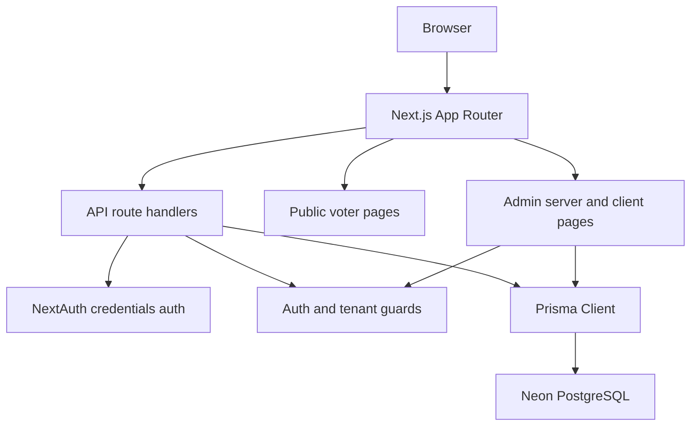
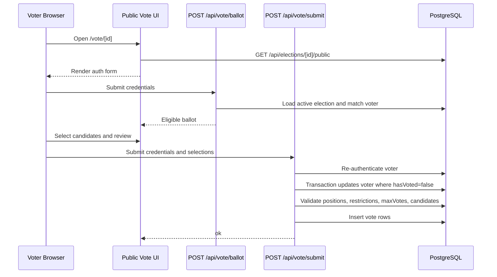

# Votelyt Architecture

This document describes the current Votelyt implementation. It is internal engineering documentation, not a product overview.

## System Overview

Votelyt is a single Next.js application that serves both the admin console and the public voter experience. The same app owns frontend rendering, API route handlers, authentication, Prisma data access, and database-backed election operations.

The deployment target is Vercel with PostgreSQL hosted on Neon. Prisma uses the Neon serverless adapter in `lib/prisma.ts`, backed by `DATABASE_URL`.

## Frontend Structure

The app uses the Next.js 16 App Router.

- `app/page.tsx` is the public landing page.
- `app/admin/(auth)` contains public admin login and signup pages.
- `app/admin/(console)` contains authenticated admin console routes.
- `app/vote/page.tsx` lets voters enter an election ID.
- `app/vote/[id]/page.tsx` implements the voter login, ballot, review, submit, and post-submit reset flow.
- `components/admin` contains console-specific components such as `PhaseController`, `TurnoutWidget`, `ResultsChart`, and `ResultsPodium`.
- `components/ui` contains shared visual primitives.
- `components/vote/HoldToConfirm.tsx` supports the voter submit confirmation interaction.

Admin pages mix server-side authorization and client-side interaction:

- `app/admin/(console)/layout.tsx` calls `getCurrentUser()` and redirects unauthenticated users to `/admin/login`.
- `app/admin/(console)/page.tsx` queries tenant-scoped elections.
- `app/admin/(console)/elections/[id]/page.tsx` queries one tenant-scoped election and passes serialized data to `ElectionConsole`.
- `ElectionConsole.tsx` performs mutations through `/api/elections/*` route handlers.

## Backend Structure

The backend is implemented with Next.js Route Handlers under `app/api`.

Admin API groups:

- `app/api/elections/route.ts`: list and create elections.
- `app/api/elections/[id]/route.ts`: read, update, and delete one election.
- `app/api/elections/[id]/status/route.ts`: transition election status.
- `app/api/elections/[id]/positions/route.ts`: create positions.
- `app/api/elections/[id]/candidates/route.ts`: create and delete candidates.
- `app/api/elections/[id]/voters/route.ts`: list, import, add, and clear voters.
- `app/api/elections/[id]/voters/[voterId]/route.ts`: remove one voter.
- `app/api/elections/[id]/voters/[voterId]/regenerate/route.ts`: regenerate one voter access code.
- `app/api/elections/[id]/voters/regenerate/route.ts`: bulk-regenerate voter access codes.
- `app/api/elections/[id]/results/route.ts`: return results after the election is closed.
- `app/api/elections/[id]/turnout/route.ts`: return turnout counts and time series.

Public voter API groups:

- `app/api/elections/[id]/public/route.ts`: public election metadata required by the voter UI.
- `app/api/vote/ballot/route.ts`: authenticate a voter and return the eligible ballot.
- `app/api/vote/submit/route.ts`: re-authenticate, atomically claim the voter, validate selections, and write votes.

Authentication API groups:

- `app/api/auth/[...nextauth]/route.ts`: NextAuth handler.
- `app/api/auth/signup/route.ts`: public account signup.

## Authentication Flow

Admin authentication uses NextAuth v4 with the Credentials provider.

Important files:

- `lib/authOptions.ts`
- `lib/auth.ts`
- `lib/tenant.ts`
- `types/next-auth.d.ts`

The credentials provider:

1. Normalizes `username` with `trim()`.
2. Loads `User` by unique username.
3. Verifies password with `bcrypt.compare()`.
4. Stores `id` and `role` in the JWT.

Sessions use the JWT strategy with a seven-day max age. On each JWT callback, the app reloads the current role from the database. If the user no longer exists, the token is marked invalid and `getCurrentUser()` treats the request as logged out.

Admin route protection is split by surface:

- Server components use `getCurrentUser()` and `redirect("/admin/login")`.
- API route handlers use `requireUser()` or `authorizeElection()`.
- `authorizeElection()` returns `401` when there is no session and `404` when the election does not exist or is outside the user's tenant scope.

## Authorization and Tenant Scope

Every election belongs to a `User` through `Election.ownerId`.

`lib/tenant.ts` provides:

- `ownerScope(user)`: returns `{ ownerId: user.id }` for normal users and `{}` for `SUPERADMIN`.
- `canAccessElection(user, electionId)`: checks ownership with a single scoped query.
- `authorizeElection(electionId)`: combines session and tenant access checks.

Regular users can only access their own elections. `SUPERADMIN` can access all elections.

## Prisma Layer

The Prisma client is initialized in `lib/prisma.ts`.

Key implementation details:

- Uses `PrismaNeon` from `@prisma/adapter-neon`.
- Reads the Neon pooled connection string from `DATABASE_URL`.
- Uses a `globalThis` singleton outside production to avoid creating many clients during development hot reload.
- Logs `error` and `warn` in development and `error` in production.

The Prisma schema is in `prisma/schema.prisma`; migrations are in `prisma/migrations`.

## Vote Submission Flow

The double-vote control is in `app/api/vote/submit/route.ts`. Inside a transaction, the server runs `tx.voter.updateMany({ where: { id, hasVoted: false }, data: { hasVoted: true, votedAt: new Date() } })`. Exactly one concurrent submission can claim a voter. If the claim updates zero rows, the route returns `409`.

## Major Folders

| Path | Responsibility |
|---|---|
| `app/admin/(auth)` | Public login and signup routes for admins. |
| `app/admin/(console)` | Authenticated admin console pages. |
| `app/api/auth` | Signup and NextAuth route handlers. |
| `app/api/elections` | Admin election management APIs plus public election metadata. |
| `app/api/vote` | Public ballot retrieval and vote submission APIs. |
| `app/vote` | Public voter UI. |
| `components/admin` | Admin dashboard, lifecycle, turnout, and results components. |
| `components/ui` | Shared UI primitives and visual shell components. |
| `components/vote` | Voter-specific UI components. |
| `lib` | Auth helpers, tenant guards, Prisma client, tokens, CSV parsing, templates, election-integrity helpers. |
| `prisma` | Prisma schema, migrations, and seed script. |
| `scripts` | Local utility scripts, currently including the voting concurrency load test. |

## Runtime Notes

- Routes that use Prisma and bcrypt pin `runtime = "nodejs"` where needed.
- Voter import and bulk access-code regeneration set `maxDuration = 60`.
- Results views are dynamically imported in `ElectionConsole.tsx` because they pull in heavier charting and animation code.
- `npm run dev` runs `next dev --webpack`; `npm run dev:turbo` uses the default Next dev server.
