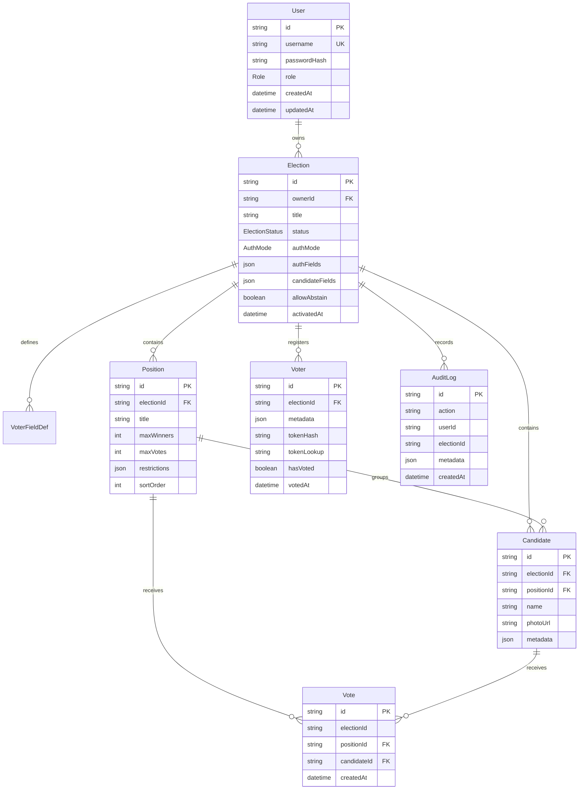

# Votelyt Database

The database is PostgreSQL, accessed through Prisma. The current schema is defined in `prisma/schema.prisma`; migration history is stored in `prisma/migrations`.

## Entity Relationship Overview

## Enums

| Enum | Values | Use |
|---|---|---|
| `ElectionStatus` | `DRAFT`, `ACTIVE`, `ENDED` | Internal lifecycle state. UI labels these as Draft, Open, and Close or Closed. |
| `ElectionTemplate` | `GENERIC`, `SCHOOL` | Distinguishes fixed school setup from generic/custom elections. |
| `AuthMode` | `ACCESS_CODE`, `TWO_FIELDS` | Voter authentication mode. |
| `Role` | `USER`, `SUPERADMIN` | Admin authorization scope. |

## User

Purpose: stores admin accounts.

Important fields:

- `id`: CUID primary key.
- `username`: unique login identifier.
- `passwordHash`: bcrypt password hash.
- `role`: `USER` or `SUPERADMIN`.
- `createdAt`, `updatedAt`: account timestamps.

Relationships:

- `User.elections` owns many `Election` records.

Integrity considerations:

- Username uniqueness is enforced by Prisma and PostgreSQL.
- Password hashes are never returned by signup.
- Deleting a user cascades to owned elections through `Election.owner`.

## Election

Purpose: top-level election configuration and lifecycle state.

Important fields:

- `id`: six-character public election ID generated by `generateElectionId()`.
- `ownerId`: tenant owner.
- `title`, `description`: admin-visible and voter-visible election metadata.
- `template`: `GENERIC` or `SCHOOL`.
- `status`: `DRAFT`, `ACTIVE`, or `ENDED`.
- `authMode`: `ACCESS_CODE` or `TWO_FIELDS`.
- `authFields`: JSON field names used for two-field voter login.
- `candidateFields`: JSON custom candidate field definitions.
- `allowAbstain`: controls whether eligible positions may be left blank.
- `activatedAt`: set the first time the election opens.

Relationships:

- Belongs to `User`.
- Has many `VoterFieldDef`, `Position`, `Voter`, and `Candidate`.
- Has associated `AuditLog` rows by `electionId`; there is no Prisma relation declared for audit logs.

Indexes:

- `ownerId`
- `status`

Integrity considerations:

- One-way status transitions are enforced in `app/api/elections/[id]/status/route.ts`.
- Setup mutations check both `status === "DRAFT"` and `activatedAt === null`.
- Existing `ACTIVE` or `ENDED` elections were backfilled with `activatedAt = updatedAt` in migration `20260610120000_add_audit_logs_and_activation_tracking`.
- `DELETE /api/elections/[id]` deletes the election after authorization and cascades child records. It does not currently block deletion after opening.

## VoterFieldDef

Purpose: defines custom voter metadata columns for an election.

Important fields:

- `fieldName`: stable metadata key.
- `fieldLabel`: UI label.
- `isIdentifier`: marks the primary unique voter identifier used during import validation.
- `isRequired`: used by setup/import flows.
- `sortOrder`: display order.

Relationships:

- Belongs to `Election`.

Integrity considerations:

- The database does not enforce uniqueness of `fieldName` per election.
- Import logic uses the first `isIdentifier` field to prevent duplicate voter identifiers inside an election.

## Position

Purpose: defines a contest within an election.

Important fields:

- `electionId`: parent election.
- `title`, `description`: contest text.
- `maxWinners`: result winner count.
- `maxVotes`: number of candidates a voter may select.
- `restrictions`: JSON eligibility rules matched against voter metadata.
- `sortOrder`: display order.

Relationships:

- Belongs to `Election`.
- Has many `Candidate`.
- Has many `Vote`.

Integrity considerations:

- Deleting a position cascades candidates and votes at the database level, but the current API surface does not expose a position deletion route.
- Position creation is blocked after opening through `requireSetupMutableElection()`.
- The database does not enforce positive `maxVotes` or `maxWinners`; route handlers and UI are responsible for valid values.

## Candidate

Purpose: candidate entry under a position.

Important fields:

- `electionId`: parent election.
- `positionId`: parent position.
- `name`, `description`: candidate data.
- `photoUrl`: optional data URL generated from an uploaded image.
- `metadata`: JSON custom candidate fields.

Relationships:

- Belongs to `Election`.
- Belongs to `Position`.
- Has many `Vote`.

Indexes:

- `electionId`
- `positionId`

Integrity considerations:

- Candidate creation verifies the selected position belongs to the same election.
- Candidate creation is blocked after opening.
- Candidate delete attempts are audit logged.
- Candidate deletion is blocked when `status !== "DRAFT"` or `activatedAt !== null`.
- Vote rows cascade if a candidate is deleted at the database level, which is why deletion is blocked after opening.

## Voter

Purpose: voter roll entry and turnout state.

Important fields:

- `electionId`: parent election.
- `metadata`: custom voter data from import or manual add.
- `tokenHash`: bcrypt hash for access-code elections; nullable for two-field elections.
- `tokenLookup`: SHA-256 fingerprint of the access code for indexed lookup.
- `hasVoted`: turnout and double-vote guard.
- `votedAt`: timestamp recorded when the atomic claim succeeds.

Relationships:

- Belongs to `Election`.

Indexes and constraints:

- `electionId`
- `(electionId, hasVoted)`
- unique `(electionId, tokenLookup)`

Integrity considerations:

- PostgreSQL allows multiple `NULL` values in a unique constraint, so two-field voters can have `tokenLookup = NULL`.
- Access-code lookup is O(1) through `tokenLookup`, then bcrypt verifies the submitted code.
- `hasVoted` is atomically claimed during vote submission with `updateMany({ where: { id, hasVoted: false } })`.
- Vote rows do not store `voterId`, so cast ballots are not directly linkable to voter records.

## Vote

Purpose: stores one candidate selection.

Important fields:

- `electionId`: denormalized election ID for result queries.
- `positionId`: contest.
- `candidateId`: selected candidate.
- `createdAt`: insertion timestamp.

Relationships:

- Belongs to `Position`.
- Belongs to `Candidate`.
- Does not belong to `Voter`.

Indexes:

- `electionId`
- `positionId`
- `candidateId`

Integrity considerations:

- No unique constraint prevents duplicate vote rows for the same voter because votes intentionally do not reference voters.
- Double-vote prevention depends on `Voter.hasVoted` being atomically claimed in the vote transaction.
- Selection validity is enforced by `app/api/vote/submit/route.ts` before vote rows are inserted.

## AuditLog

Purpose: backend-only record of administrative integrity events.

Important fields:

- `action`: event name.
- `userId`: admin user who triggered the action.
- `electionId`: election associated with the action.
- `metadata`: optional JSON details.
- `createdAt`: insertion timestamp.

Indexes:

- `action`
- `userId`
- `electionId`
- `createdAt`

Integrity considerations:

- `AuditLog` does not declare foreign keys to `User` or `Election`.
- Logs are inserted through `writeAuditLog()` in `lib/electionIntegrity.ts`.
- `writeAuditLog()` uses raw SQL because metadata is serialized explicitly as JSONB.
- There is no frontend audit-log viewer in the current app.

## Cascade Behavior

Configured cascades:

- Deleting a `User` deletes owned `Election` rows.
- Deleting an `Election` deletes voter fields, positions, voters, and candidates.
- Deleting a `Position` deletes candidates and votes.
- Deleting a `Candidate` deletes votes.

Operational implication: destructive deletion of election setup or candidate data can affect historical results. The current integrity layer blocks candidate deletion after opening and does not expose position deletion, but election deletion still cascades all election data after admin authorization.
