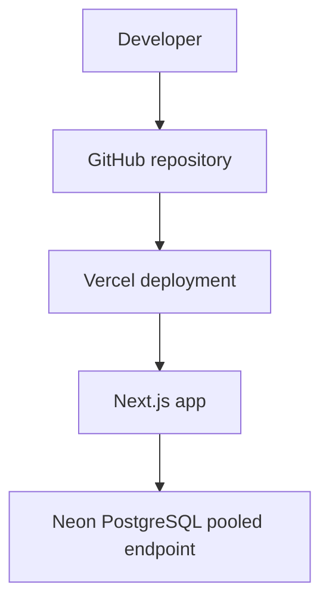

# Votelyt Deployment

The production target is Vercel for the Next.js application and Neon PostgreSQL for the database.

## Hosting Architecture



The app is a single Next.js project. There is no separate backend service.

## Required Environment Variables

Defined in `.env.example`:

| Variable | Required | Used by | Notes |
|---|---:|---|---|
| `DATABASE_URL` | Yes | Prisma, seed script, load test | Use the Neon pooled connection string with `sslmode=require`. |
| `NEXTAUTH_SECRET` | Yes | NextAuth | JWT signing secret. Rotating it invalidates existing sessions. |
| `NEXTAUTH_URL` | Yes | NextAuth | Public base URL, for example the production Vercel URL. |
| `SUPERADMIN_USERNAME` | Seed only | `prisma/seed.ts` | Bootstrap superadmin username. |
| `SUPERADMIN_PASSWORD` | Seed only | `prisma/seed.ts` | Bootstrap superadmin password. |

No current environment variable is prefixed with `NEXT_PUBLIC_`.

## Package Scripts

From `package.json`:

| Script | Command | Use |
|---|---|---|
| `dev` | `next dev --webpack` | Local development using Webpack. |
| `dev:turbo` | `next dev` | Local development using the default Next dev server. |
| `build` | `prisma generate && next build` | Production build. |
| `start` | `next start` | Start built app. |
| `lint` | `eslint` | Lint source files. |
| `postinstall` | `prisma generate` | Regenerate Prisma client after dependency install. |

There is no `typecheck` script in `package.json`; use `npx tsc --noEmit` when a manual typecheck is needed.

## Prisma Generate and Migrations

`npm run build` runs `prisma generate` before `next build`.

Migration files are committed under `prisma/migrations`. The production migration command should be:

```bash
npx prisma migrate deploy
```

Do not use `prisma migrate reset` or `prisma db push --force-reset` against production.

Recommended schema deployment order:

1. Back up or branch the Neon database.
2. Run `npx prisma migrate deploy`.
3. Deploy the application build that expects the new schema.

## Neon PostgreSQL

The app uses the Neon serverless adapter:

```ts
const adapter = new PrismaNeon({ connectionString: process.env.DATABASE_URL! });
```

Use the pooled Neon connection string. This is important for serverless execution and Neon autosuspend behavior.

## Vercel Build

Vercel should install dependencies and run:

```bash
npm run build
```

The build command expands to:

```bash
prisma generate && next build
```

Prisma migrations are not automatically applied by the build script. Apply migrations separately with `npx prisma migrate deploy`.

## Bootstrap Seed

`prisma/seed.ts` creates or updates the configured superadmin.

Run with environment variables set:

```bash
node prisma/seed.ts
```

Behavior:

- Requires `SUPERADMIN_USERNAME` and `SUPERADMIN_PASSWORD`.
- Hashes the password with bcrypt.
- Reuses an existing configured user or the first existing `SUPERADMIN`.
- Updates the bootstrap account to role `SUPERADMIN`.
- Attempts to backfill ownerless elections to the superadmin, preserved for historical safety.

## Runtime Characteristics

- API routes using bcrypt and Prisma run on Node.js where declared.
- Voter import uses `maxDuration = 60`.
- Bulk code regeneration uses `maxDuration = 60`.
- Bulk code regeneration rejects more than 500 voters in one request.
- Prisma logs errors in production.

## Production Checklist

Before production deployment:

- Set `DATABASE_URL` to the Neon pooled production database URL.
- Set `NEXTAUTH_SECRET` to a generated secret, for example `openssl rand -base64 32`.
- Set `NEXTAUTH_URL` to the production Vercel URL or custom domain.
- Apply migrations with `npx prisma migrate deploy`.
- Run the seed script only when intentionally creating or rotating the bootstrap superadmin.
- Run `npm run lint`.
- Run `npx tsc --noEmit`.
- Run `npm run build`.
- Verify admin login, election creation, voter import, opening, vote submission, closing, and results on the target environment.
- Confirm logs and database backups are available outside the app.

## Rollback

Application rollback:

- Use Vercel deployment rollback or promote a known-good deployment.
- This does not roll back the database.

Database rollback:

- Prefer a forward migration that reverses a bad schema change.
- Use Neon point-in-time restore or a pre-change branch for recovery.
- Avoid editing already-applied migration files.

## Operational Risks

- There is no repository-level monitoring configuration.
- There is no rate limiting.
- Destructive election deletion cascades all election data after authorization.
- Migrations are not automatically deployed by the build script; missing migration deployment can cause runtime errors after schema changes.
- Candidate photos are stored in the database as data URLs, increasing row size.
