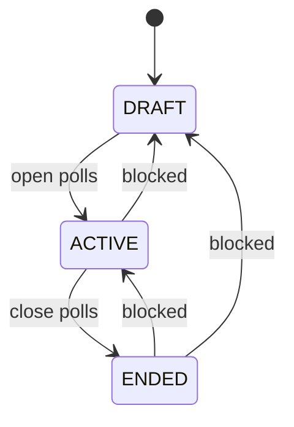

# Election Lifecycle

Votelyt stores lifecycle state in the `ElectionStatus` enum:

- `DRAFT`
- `ACTIVE`
- `ENDED`

The UI presents these states as Draft, Open, and Close or Closed. This document uses the internal enum names where implementation details matter.

## Lifecycle State Machine



Allowed server-side transitions:

| From | To | Allowed |
|---|---|---:|
| `DRAFT` | `ACTIVE` | Yes |
| `ACTIVE` | `ENDED` | Yes |
| `ACTIVE` | `DRAFT` | No |
| `ENDED` | `ACTIVE` | No |
| `ENDED` | `DRAFT` | No |
| `DRAFT` | `ENDED` | No |

The transition logic is implemented in `app/api/elections/[id]/status/route.ts`.

## Transition Enforcement

`PATCH /api/elections/[id]/status`:

1. Calls `authorizeElection(id)`.
2. Parses `status` from JSON.
3. Rejects values outside `DRAFT`, `ACTIVE`, and `ENDED`.
4. Runs a Prisma transaction.
5. Loads the current election status and `activatedAt`.
6. Applies `isAllowedTransition(current.status, requestedStatus)`.
7. Uses `updateMany({ where: { id, status: current.status } })` to avoid overwriting a concurrent status change.
8. Writes an audit log for successful activation or ending.

Invalid transitions return `400` with:

```json
{
  "error": "Invalid status transition: ACTIVE -> DRAFT. Allowed transitions are DRAFT -> ACTIVE and ACTIVE -> ENDED."
}
```

Concurrent status changes return `409` with:

```json
{
  "error": "Election status changed while processing the request. Please reload and try again."
}
```

## activatedAt

`Election.activatedAt` records whether an election has ever opened.

Behavior:

- When transitioning to `ACTIVE`, the route sets `activatedAt` to the current time if it is still `null`.
- If `activatedAt` already has a value, it is preserved.
- The migration `20260610120000_add_audit_logs_and_activation_tracking` backfilled existing `ACTIVE` and `ENDED` elections with `updatedAt` as the best available historical approximation.

This timestamp is used to distinguish elections that are merely in `DRAFT` from elections that have historical ballot state. The current transition rules prevent returning to `DRAFT`, but the integrity helper still checks `activatedAt` as an additional guard.

## Frozen Election Behavior

Setup mutability is centralized in `lib/electionIntegrity.ts`.

```ts
export function isSetupMutable(election: ElectionIntegrityState): boolean {
  return election.status === "DRAFT" && election.activatedAt === null;
}
```

Routes call `requireSetupMutableElection()` before setup mutations. If the election is not mutable, the API writes an audit log with action `BLOCKED_ACTIVE_MUTATION` and returns `403`.

Shared error message:

```text
Election draft configuration is locked after polls open. Only monitoring and ending the election are allowed.
```

## Mutations Blocked After Opening

The following server-side paths check the frozen-election helper:

| Operation | Route | Attempted action |
|---|---|---|
| Election configuration update | `PATCH /api/elections/[id]` | `election.configure` |
| Position creation | `POST /api/elections/[id]/positions` | `position.create` |
| Candidate creation | `POST /api/elections/[id]/candidates` | `candidate.create` |
| Candidate deletion | `DELETE /api/elections/[id]/candidates` | `candidate.delete` |
| Voter import or single add | `POST /api/elections/[id]/voters` | `voters.import` |
| Clear voter roll | `DELETE /api/elections/[id]/voters` | `voters.clear` |
| Remove one voter | `DELETE /api/elections/[id]/voters/[voterId]` | `voter.remove` |
| Regenerate one code | `POST /api/elections/[id]/voters/[voterId]/regenerate` | `voter_code.regenerate` |
| Regenerate codes in bulk | `POST /api/elections/[id]/voters/regenerate` | `voter_codes.regenerate` |

There are no current API routes for candidate editing, position editing, or position deletion.

## Actions Still Allowed While ACTIVE

After an election is `ACTIVE`, the intended admin operations are monitoring and ending the election.

Currently allowed server-side operations include:

- `GET /api/elections/[id]`
- `GET /api/elections/[id]/turnout`
- `PATCH /api/elections/[id]/status` from `ACTIVE` to `ENDED`
- `GET /api/elections/[id]/results`, but it returns `403` until `ENDED`
- `DELETE /api/elections/[id]` after authorization

The last item is important: election deletion is still available after authorization and cascades all election data. It is not governed by `requireSetupMutableElection()` in the current codebase.

## Audit Logging Around Lifecycle Events

Audit logs are written through `writeAuditLog()` in `lib/electionIntegrity.ts`.

Lifecycle-related actions:

- `ELECTION_CREATED`
- `ELECTION_ACTIVATED`
- `ELECTION_ENDED`
- `INVALID_STATUS_TRANSITION`
- `BLOCKED_ACTIVE_MUTATION`

Candidate and voter actions that interact with lifecycle freezing:

- `CANDIDATE_CREATED`
- `CANDIDATE_DELETE_ATTEMPTED`
- `VOTERS_IMPORTED`
- `VOTERS_REMOVED`
- `VOTER_CODES_REGENERATED`

Audit logs are backend-only. There is no admin UI to browse logs.

## Results Availability

`GET /api/elections/[id]/results` requires admin authorization and checks election status.

- If status is not `ENDED`, the route returns `403` with `Results are blocked until election ends`.
- If status is `ENDED`, it returns positions with candidates ordered by vote count and tie-aware winner marking.

## Known Lifecycle Limitations

- The database itself does not enforce status transition rules; enforcement is in the route handler.
- There is no soft-delete model for elections.
- `DELETE /api/elections/[id]` can delete a previously opened election after authorization.
- There is no position update or delete API in the current route surface.
- Audit logs do not have foreign keys to users or elections and have no frontend viewer.
