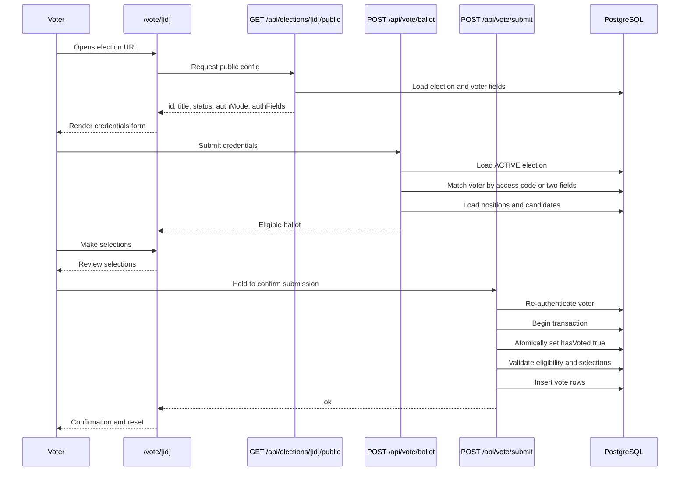

# Voting Flow

This document describes the implemented public voter flow and server-side vote handling.

## Summary

Voting is public in the sense that voters do not need admin sessions. Voters authenticate with election-specific credentials, either an access code or two configured voter fields. The vote submission route re-authenticates the voter and uses a database transaction to prevent duplicate voting.

Votes are stored as candidate selections without a `voterId`. Turnout is tracked separately on `Voter.hasVoted` and `Voter.votedAt`.

## Sequence



## 1. Voter Receives Credentials

Administrators create or import voters while the election is mutable.

Access-code elections:

- `POST /api/elections/[id]/voters` generates a raw code with `generateToken()`.
- The raw code is returned once to the admin.
- `tokenHash` stores a bcrypt hash.
- `tokenLookup` stores a SHA-256 fingerprint for indexed lookup.

Two-field elections:

- `Election.authFields` contains two voter metadata field names.
- Voter metadata values are imported from CSV, XLS, XLSX, or JSON.
- No access code is generated.

## 2. Voter Authenticates

The voter UI first loads public metadata from `GET /api/elections/[id]/public`.

That endpoint is intentionally unauthenticated and returns only:

- `id`
- `title`
- `status`
- `authMode`
- `authFields`
- `allowAbstain`

The voter then posts credentials to `POST /api/vote/ballot`.

Access-code matching:

1. Reads `credentials.access_code`.
2. Fingerprints the submitted code.
3. Looks up `Voter` by `(electionId, tokenLookup)`.
4. Verifies the submitted code with bcrypt.

Two-field matching:

1. Loads voters for the election.
2. Compares both configured metadata fields case-insensitively.
3. Selects the first matching voter.

If the election is not `ACTIVE`, the ballot route returns `403`.

## 3. Ballot Is Retrieved

`POST /api/vote/ballot` loads positions and candidates for the election.

For each position, it checks `Position.restrictions` against the matched voter's metadata. Positions with no restrictions are included for everyone. Restricted positions are included only when every configured key/value pair matches the voter's metadata.

The response includes:

- `voterId`
- optional `voterName`
- eligible positions
- candidates for each eligible position
- `maxVotes` and `maxWinners`

The client stores the credentials in memory and moves to the ballot step.

## 4. Voter Makes Selections

`app/vote/[id]/page.tsx` controls selection state in the browser.

Client-side behavior:

- Single-select positions replace the existing candidate when `maxVotes === 1`.
- Multi-select positions prevent adding more than `maxVotes`.
- The review step builds `selections` from the displayed ballot.
- When `allowAbstain` is false, the UI prevents advancing past an eligible position with candidates and no selection.

The server repeats critical validation during submit.

## 5. Vote Is Submitted

The UI posts to `POST /api/vote/submit` with:

- `electionId`
- credentials
- selections as `{ positionId, candidateIds[] }`

The submit route rejects missing fields with `400`, invalid credentials with `401`, non-active elections with `403`, duplicate votes with `409`, and most validation failures with `400`.

## 6. Server Validates Eligibility

Before writing votes, `POST /api/vote/submit`:

1. Loads the election.
2. Requires `status === "ACTIVE"`.
3. Re-authenticates the voter.
4. Loads positions and candidates inside a transaction.
5. Checks every submitted position exists.
6. Re-checks position restrictions against voter metadata.
7. Enforces `maxVotes`.
8. Rejects duplicate candidate IDs within a position.
9. Verifies every candidate belongs to the submitted position.
10. If `allowAbstain` is false, requires a selection for every eligible position that has candidates.

## 7. Server Atomically Claims the Voter

Double-vote prevention is implemented in the submit transaction:

```ts
const claim = await tx.voter.updateMany({
  where: { id: matchedVoter.id, hasVoted: false },
  data: { hasVoted: true, votedAt: new Date() },
});
```

If `claim.count !== 1`, the route throws `ALREADY_VOTED` and returns:

```json
{
  "error": "You have already voted"
}
```

with status `409`.

Because this update occurs inside the same transaction as vote insertion, later validation failures roll back the claim and allow a legitimate retry.

## 8. Votes Are Stored

For every selected candidate ID, the server inserts one `Vote` row:

- `electionId`
- `positionId`
- `candidateId`

No `voterId` is stored on `Vote`. This preserves separation between turnout state and ballot selections, but it also means individual vote rows cannot be tied back to a voter for dispute resolution.

## 9. Results Are Calculated After Close

`GET /api/elections/[id]/results`:

- Requires admin authentication and tenant authorization.
- Returns `403` until `Election.status === "ENDED"`.
- Loads positions and candidates.
- Uses Prisma `_count.votes` per candidate.
- Sorts candidates by vote count descending and then by name.
- Marks winners using `maxWinners` and the cutoff vote count, so ties at the cutoff are marked as winners.

## Double-Vote Prevention

Primary control:

- Atomic update of `Voter.hasVoted` from `false` to `true`.

Supporting controls:

- Ballot retrieval rejects voters already marked `hasVoted`.
- Submit route re-authenticates voters instead of trusting the client-provided `voterId`.
- Access-code regeneration does not reset `hasVoted`.

## Concurrency Behavior

For concurrent submissions with the same credentials:

- Multiple requests may authenticate successfully at the beginning.
- Only one request can update `hasVoted` from `false` to `true`.
- Other requests fail with `409`.
- The transaction ensures no vote rows are inserted if validation fails after the claim.

The repository includes `scripts/loadtest.mjs`, which creates a throwaway active election, fires concurrent vote submissions, verifies vote counts and `hasVoted`, replays the same codes to confirm duplicate rejection, and cleans up the sandbox data.

## Stale Ballot Behavior

The submit route revalidates election status, voter eligibility, positions, candidates, duplicate candidate IDs, and `maxVotes`. This protects against many stale client states.

Expected stale-state outcomes:

- Election closed after ballot load: submit returns `403`.
- Candidate deleted before opening and before voter loads a ballot: stale candidate IDs are rejected as invalid.
- Election setup changes after opening: setup mutation routes should be blocked, so the ballot should remain stable while voting is active.
- Voter already voted in another tab: submit returns `409`.

## Known Limitations

- There is no rate limiting on voter authentication or submission endpoints.
- Two-field voter authentication scans all voters for the election and compares metadata in application code; this can become slow for large voter rolls.
- There is no signed ballot snapshot or ballot version field.
- Vote rows do not include `voterId`, which protects privacy but limits forensic traceability.
- There is no vote receipt mechanism.
- Vote submission does not currently write audit logs, likely intentionally to avoid voter-level audit trails.
- If a network failure occurs after a successful server commit but before the browser receives the response, retrying with the same credentials will return `409` because the vote has already been recorded.
